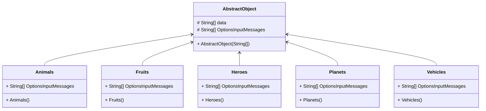

# Single Linked-list: Struktur Data

<p align="center">
    
</p>

### Landasan Teori

Single Linked-list adalah struktur data yang terdiri dari kumpulan node yang saling terhubung satu sama lain. Setiap node memiliki data dan pointer yang menunjuk ke node selanjutnya. Node pertama disebut head dan node terakhir disebut tail. Jika node hanya memiliki satu node, maka node tersebut merupakan head dan tail. Jika node tidak memiliki node, maka node tersebut merupakan head dan tail.

### Implementasi

Untuk implementasi single linked-list, kita akan menggunakan bahasa pemrograman Java. Untuk mempermudah, kita akan membuat class Node dan class SingleLinkedList. Class Node berfungsi untuk menyimpan data dan pointer ke node selanjutnya. Class SingleLinkedList berfungsi untuk menyimpan head dan tail dari single linked-list.

#### Class Node

```java
public class Node {
    private int data;
    private Node next;

    public Node(int data) {
        this.data = data;
        this.next = null;
    }

    public int getData() {
        return data;
    }

    public void setData(int data) {
        this.data = data;
    }

    public Node getNext() {
        return next;
    }

    public void setNext(Node next) {
        this.next = next;
    }
}
```

#### Class SingleLinkedList

```java
public class SingleLinkedList {
    private Node head;
    private Node tail;

    public SingleLinkedList() {
        this.head = null;
        this.tail = null;
    }

    public void add(int data) {
        Node node = new Node(data);

        if (head == null) {
            head = node;
            tail = node;
        } else {
            tail.setNext(node);
            tail = node;
        }
    }

    public void print() {
        Node current = head;

        while (current != null) {
            System.out.print(current.getData() + " ");
            current = current.getNext();
        }
    }
}
```

### Contoh Penggunaan

```java
public class Main {
    public static void main(String[] args) {
        SingleLinkedList list = new SingleLinkedList();

        list.add(1);
        list.add(2);
        list.add(3);
        list.add(4);
        list.add(5);

        list.print();
    }
}
```

### Output

```
1 2 3 4 5
```

### Algoritma Pada Single Linked-list

#### add()

1. Buat node baru dengan data yang akan ditambahkan
2. Jika head adalah null, maka node baru akan menjadi head dan tail
3. Jika head bukan null, maka node baru akan menjadi tail dan node sebelumnya akan menunjuk ke node baru
4. Node baru akan menjadi tail
5. Selesai
6. Jika head adalah null, maka node baru akan menjadi head dan tail
7. Jika head bukan null, maka node baru akan menjadi tail dan node sebelumnya akan menunjuk ke node baru
8. Node baru akan menjadi tail
9. Selesai

### Praktikum Single Lingked-list pada Kehidupan Sehari-hari
|  Object  |              Input data              |
|:--------:|:------------------------------------:|
| Animals  |      Nama hewan dan habitatnya       |
|  Fruits  |        Nama buah dan rasanya         |
|  Heroes  |   Nama pahlawan dan asal lahirnya    |
| Planets  | Nama planet dan lama revolusinyanya  |
| Vehicles | Nama kendaraan dan jenis bahan bakar |

### Implementasi dalam kode program java
Karena objek memiliki kesamaan, yaitu untuk menginput dua data yang akan disimpan dalam tiap-tiap objek tersebut.
Maka kita dapat membuat kelas abstrak yang akan menjadi induk dari kelas-kelas objek yang akan dibuat.
Sehingga struktur kelas terlihat lebih rapi dengan menugganakan relasi has-a.

### Kelas abstrak AbstractObject
```java
package Objects;

import java.util.Scanner;

public abstract class AbstractObject {
    protected String[] data;

    protected String[] OptionsInputMessages;

    public AbstractObject(String[] OptionsInputMessages) {
        this.setOptionsInputMessages(OptionsInputMessages);
    }

    public String[] getData() {
        return this.data;
    }

    public void setData(String[] data) {
        this.data = data;
    }

    public String[] getOptionsInputMessages() {
        return OptionsInputMessages;
    }

    public void setOptionsInputMessages(String[] optionsInputMessages) {
        OptionsInputMessages = optionsInputMessages;
    }

    public String[] promptInput() {
        String[] output = new String[getOptionsInputMessages().length];
        System.out.println("Input " + getOptionsInputMessages().length + " data");
        for (int i = 0; i < getOptionsInputMessages().length; i++) {
            System.out.print(getOptionsInputMessages()[i]);
            Scanner scanner = new Scanner(System.in);
            output[i] = scanner.next();
        }

        return output;
    }
}
```

### Kelas objek benda
#### Animals
```java
package Objects;

public class Animals extends AbstractObject {
    public static String[] OptionsInputMessages = {"Name: ", "Habitat: "};
    public Animals() {
        super(OptionsInputMessages);
    }
}
```

#### Fruits
```java
package Objects;

public class Fruits extends AbstractObject {
    public static String[] OptionsInputMessages = {"Name: ", "Flavor: "};

    public Fruits() {
        super(OptionsInputMessages);
    }
}
```

#### Heroes
```java
package Objects;

public class Heroes extends AbstractObject {
    public static String[] OptionsInputMessages = {"Name: ", "Birth Place: "};

    public Heroes() {
        super(OptionsInputMessages);
    }
}
```

#### Planets
```java
package Objects;

public class Planets extends AbstractObject {
    public static String[] OptionsInputMessages = {"Name: ", "How long it takes to orbit the sun: "};
    public Planets() {
        super(OptionsInputMessages);
    }
}
```

#### Vehicles
```java
package Objects;

public class Vehicles extends AbstractObject {
    public static String[] OptionsInputMessages = {"Name: ", "Gas type: "};

    public Vehicles() {
        super(OptionsInputMessages);
    }
}
```
Sehingga relasi antar kelas terlihat seperti ini:


### Kelas untuk penghubung antar node 1 dan node 2 dan seterusnya
```java
import Objects.AbstractObject;

public class Elements {
    public AbstractObject object;
    public Elements next;
    public Elements(AbstractObject object) {
        this.object = object;
        this.next = null;
    }
}
```

### Kelas untuk mengatur node
```java
import Objects.AbstractObject;
import Objects.Heroes;

public class List {
    Elements first;

    AbstractObject object;

    public List() {
        first = null;
    }

    public void addFirst() {
        object.setData(object.promptInput());

        Elements newElement = new Elements(object);

        newElement.next = first;
        first = newElement;
    }

    public void addLast() {
        object.setData(object.promptInput());

        Elements newElement = new Elements(object);
        Elements current = first;

        while (current.next != null) {
            current = current.next;
        }

        current.next = newElement;
    }

    public void add(int index) {
        object.setData(object.promptInput());

        Elements newElement = new Elements(object);
        Elements current = first;

        for (int i = 0; i < index; i++) {
            current = current.next;
        }

        newElement.next = current.next;
        current.next = newElement;
    }

    public void removeFirst() {
        if(first == null) {
            System.out.println("The list is empty");
        } else {
            first = first.next;
        }
    }

    public void removeLast() {
        if(first == null) {
            System.out.println("The list is empty");
        } else {
            Elements current = first;
            Elements previous = first;

            while (current.next != null) {
                previous = current;
                current = current.next;
            }

            previous.next = null;
        }
    }

    public void remove(int index) {
        if(first == null) {
            System.out.println("The list is empty");
        } else {
            Elements current = first;
            Elements previous = first;

            for (int i = 0; i < index; i++) {
                previous = current;
                current = current.next;
            }

            previous.next = current.next;
        }
    }

    public void clear() {
        first = null;
    }

    public void print() {
        Elements current = first;

        while (current != null) {
            System.out.println(current.object.getData()[0]);
            current = current.next;
        }
    }

    public void setClassInstance(AbstractObject object) {
        this.object = object;
    }
}
```

### Kelas `Main` untuk mengatur menu
```java
import Objects.*;

import java.util.Scanner;
public class Main {
    public static void main(String[] args) {
        Scanner scanner = new Scanner(System.in);
        List list = new List();

        System.out.println("===================================");
        System.out.println(" Single Linked List Implementation ");
        System.out.println("===================================");
        System.out.println("Choose class to use:");
        System.out.println("1. Animals");
        System.out.println("2. Fruits");
        System.out.println("3. Heroes");
        System.out.println("4. Planets");
        System.out.println("5. Vehicles");
        System.out.print("Choose an option: ");
        int class_option = Integer.parseInt(scanner.next());

        if (class_opt > 5 || class_opt < 1) {
            System.out.println("Invalid option");
            System.exit(0);
        }

        System.out.println("===================================");
        System.out.println(" Single Linked List Implementation ");
        System.out.println("===================================");
        System.out.println("Choose an option:");
        System.out.println("1. Add first");
        System.out.println("2. Add last");
        System.out.println("3. Add at index");
        System.out.println("4. Remove first");
        System.out.println("5. Remove last");
        System.out.println("6. Remove at index");
        System.out.println("7. Print list");
        System.out.print("Choose an option: ");
        int option = Integer.parseInt(scanner.next());

        do{
            switch (class_option) {
                case 1 -> list.setClassInstance(new Animals());
                case 2 -> list.setClassInstance(new Fruits());
                case 3 -> list.setClassInstance(new Heroes());
                case 4 -> list.setClassInstance(new Planets());
                case 5 -> list.setClassInstance(new Vehicles());
            }

            System.out.println("===================================");
            switch (option) {
                case 1 -> list.addFirst();
                case 2 -> list.addLast();
                case 3 -> {
                    System.out.print("Input index: ");
                    int index = Integer.parseInt(scanner.next());
                    list.add(index);
                }
                case 4 -> list.removeFirst();
                case 5 -> list.removeLast();
                case 6 -> {
                    System.out.print("Input index: ");
                    int index2 = Integer.parseInt(scanner.next());
                    list.remove(index2);
                }
                case 7 -> list.print();
                default -> System.out.println("Invalid option");
            }

            System.out.print("Continue? (y/n): ");
            String continueOption = scanner.next();
            if (continueOption.equalsIgnoreCase("y") || continueOption.isBlank() || continueOption.isEmpty()) {
                System.out.print("Choose an option: ");
                option = Integer.parseInt(scanner.next());
            } else {
                option = 0;
            }
        } while (option != 0);
    }
}
```

Lalu jalankan program pada kelas `Main` untuk melihat hasilnya.

```
===================================
 Single Linked List Implementation 
===================================
Choose class to use:
1. Animals
2. Fruits
3. Heroes
4. Planets
5. Vehicles
Choose an option: 3
===================================
 Single Linked List Implementation 
===================================
Choose an option:
1. Add first
2. Add last
3. Add at index
4. Remove first
5. Remove last
6. Remove at index
7. Print list
Choose an option: 1
===================================
Input 2 data
Name: sutomo
Birth Place: sragen
Continue? (y/n): y
Choose an option: 1
===================================
Input 2 data
Name: sutimi
Birth Place: ragen
Continue? (y/n): y
Choose an option: 7
===================================
sutimi
sutomo
Continue? (y/n): y
Choose an option: 4
===================================
Continue? (y/n): y
Choose an option: 1
===================================
Input 2 data
Name: sutami
Birth Place: sragen timur
Continue? (y/n): y
Choose an option: 7
===================================
sutami
sutomo
===================================
```

### Kesimpulan
Pada tutorial kali ini kita telah mempelajari tentang single linked list. Single linked list merupakan salah satu jenis struktur data yang digunakan untuk menyimpan data secara linear. Single linked list memiliki kelebihan dan kekurangan yang berbeda dengan array. Single linked list memiliki kelebihan dalam hal penggunaan memori, karena hanya membutuhkan satu pointer untuk menunjuk ke elemen berikutnya. Sedangkan kekurangan dari single linked list adalah tidak dapat mengakses elemen secara random, karena hanya dapat mengakses elemen berikutnya saja.